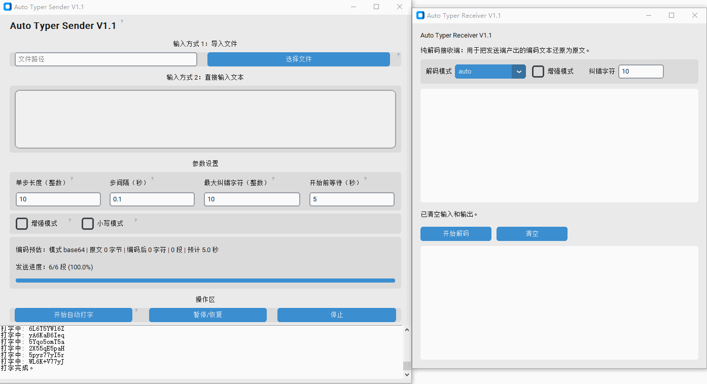

# auto_typer

Windows 平台的编码发送端 / 纯解码接收端工具，适合在无法直接复制粘贴的远程环境中传递文本内容。



## 当前版本

`V1.3`

## 版本变更

- `V1.3`：默认模式与小写模式统一使用压缩算法，显著缩短默认模式输出长度
- `V1.3`：接收端支持自动换行输入、解码结果导出为 `txt`，并缓解超长字符串输入卡顿
- `V1.2`：统一打包输出文件名，并为 exe 写入文件版本信息，便于区分发送端/接收端和版本
- `V1.1`：主程序拆分为编码发送端和纯解码接收端
- `V1.1`：小写模式从旧 `hex` 改为压缩型纯小写编码，减少打字量
- `V1.1`：发送端新增编码预估、预计耗时和发送进度显示

## 功能概览

- `auto_typer.py`：编码发送端，负责读取文本/文件、编码并自动打字
- `isolated_decoder.py`：纯解码接收端，只负责还原编码文本
- 默认模式输出压缩后的 `base64`
- 小写模式输出压缩后的纯小写编码，字符集仅包含 `0-9` 和 `a-z`
- 增强模式可与默认模式或小写模式组合使用，用于附加纠错数据

## 安装环境

```bash
pip3 install pynput==1.7.7 -i https://pypi.tuna.tsinghua.edu.cn/simple/
pip3 install customtkinter==5.2.2 -i https://pypi.tuna.tsinghua.edu.cn/simple/
pip3 install pyinstaller==6.9.0 -i https://pypi.tuna.tsinghua.edu.cn/simple/
pip3 install reedsolo==1.7.0 -i https://pypi.tuna.tsinghua.edu.cn/simple/
```

## 运行方式

启动编码发送端：

```bash
python auto_typer.py
```

启动纯解码接收端：

```bash
python isolated_decoder.py
```

## 打包

编码发送端：

```bash
pyinstaller auto_typer.spec
```

输出文件：`dist/AutoTyper-Sender-V1.3.exe`

纯解码接收端：

```bash
pyinstaller isolated_decoder.spec
```

输出文件：`dist/AutoTyper-Receiver-V1.3.exe`

## 使用说明

### 发送端

1. 打开 `auto_typer.py`
2. 选择文件，或在大文本框中直接输入内容
3. 选择编码模式和发送参数
4. 查看界面中的编码长度、段数和预计耗时
5. 点击“开始自动打字”
6. 在倒计时结束前切换到目标输入窗口

### 接收端

1. 打开 `isolated_decoder.py`
2. 粘贴发送端产出的编码文本
3. 直接点击“开始解码”
4. 解码器会自动识别默认模式、小写模式以及增强模式
5. 解码完成后可直接导出结果为 `txt` 文件

## 编码规则

- 默认模式：压缩后的 `base64`
- 小写模式：压缩后的纯小写编码
- 增强模式：可用于默认模式，也可用于小写模式

## 注意事项

- 需要在 Windows 环境下运行
- 使用前建议切换到英文输入法
- 远程环境不稳定时，建议减小单步长度并增大步间隔
- 新小写模式仅使用 `0-9` 和 `a-z`；旧版 `hex` 输出不再作为发送端默认算法
